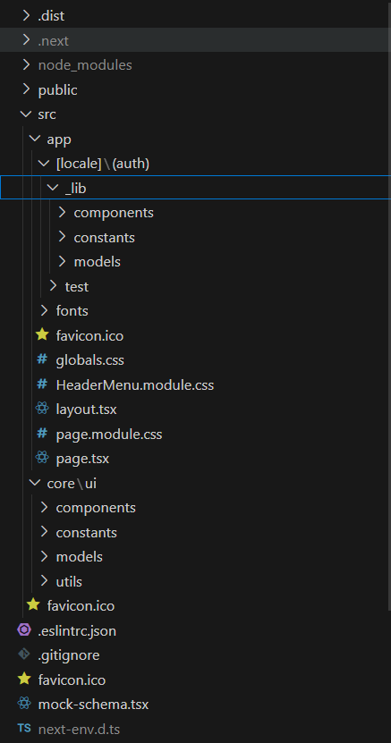
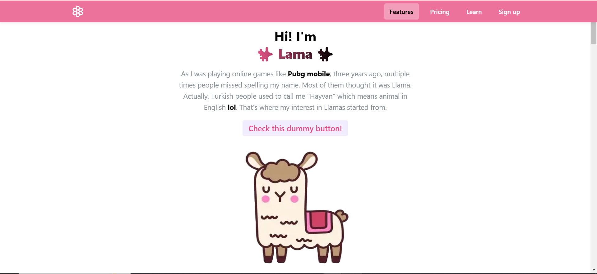
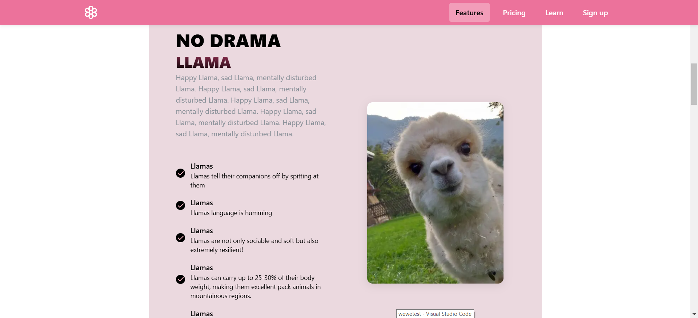

<div align="center">
  <br>
  <h1>Llama Website 🦙</h1>
  <strong>Your Source for Fun and Silly Llama Facts!</strong> &nbsp;<br>
</div>
<br>
<br>


<a name="intro"></a>
## 🌟 About the Project
<strong>This website</strong> is a simple, fun website that presents humorous and quirky facts about llamas. This project was primarily created as a learning experience to practice with Mantine components, explore React and Next.js structure, and establish coding conventions.
<br>
<br>
<br>


<a name="struct"></a>
## 📂 Project Structure
<div align="center">
  
</div>
<br>

### Key files:
* <strong> app/_lib/: </strong> Contains constants, and models used throughout the app.
* <strong> core/ui/: </strong> Houses UI-specific elements and utilities, making it easy to customize the appearance.
* <strong> public/: </strong> Stores static assets, such as icons and images.
* <strong> styles/: </strong> Includes global and modular styles to manage the look and feel of the app.
<br>


<a name="bw"></a>
## 🛠 Built With
* <strong> React</strong> - A JavaScript library for building user interfaces.
* <strong> Next.js</strong> - A React framework for server-side rendering and static site generation.
* <strong> Mantine </strong>- A modern component library for styling and design.
<br>
<p align="right">(<a href="#readme-top">⬆️ Back to top</a>)</p>
<br>


<a name="gs"></a>
## 🚀 Getting Started
### ⚙️ Running the project
#### Prerequisites
* Node.js
* npm or yarn
##### 1. Clone the repository:
> [![Github][Github]][wewe]
>
> ```sh
> git clone https://github.com/yourusername/llama-facts
> ```
##### 2. Install dependencies:
>
> ```sh
> npm install
> ```
##### 3. Run the development server:
>
> ```sh
> npm run dev
> ```
##### Open http://localhost:3000 to view in the browser.

<br>
<br>


<a name="gs"></a>
## 📷 Some pics for the desired components:
<div align="center">
  
</div>
<br>

<div align="center">
  
</div>
<br>


[Github]: https://img.shields.io/badge/GitHub-181717?style=for-the-badge&logo=github&logoColor=white
[GithubURL]: https://github.com/
[wewe]: https://github.com/LamaKhaledd/Llamaweb
